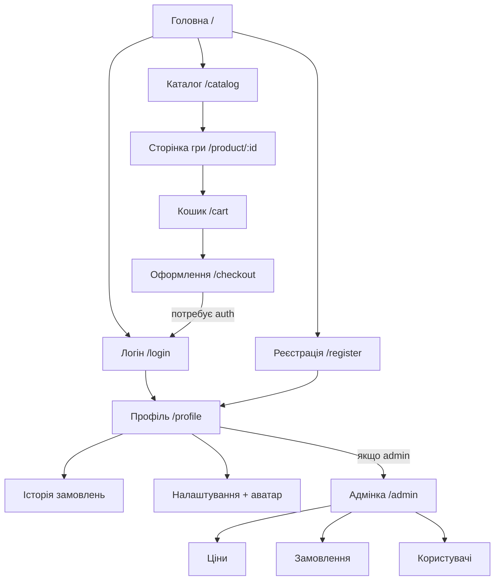

# Лабораторна робота №1 — структура сайту GameShop

Студент: Додуляк Кирило, КМ-32
Тема курсового проекту: «GameShop» — інтернет-магазин відеоігор та ігрових аксесуарів.

## 1. Тематика та зміст

GameShop — повнофункціональний багатосторінковий веб-сайт інтернет-магазину
відеоігор. Користувачі можуть переглядати каталог, читати опис та відгуки на гру,
додавати товари до кошика, оформлювати замовлення, реєструватися й керувати
профілем. Адміністратор має окремий розділ для CRUD-операцій над цінами,
користувачами та замовленнями.

Каталог наповнюється з відкритого API [RAWG.io](https://rawg.io/apidocs) (реальні
обкладинки, описи, скріншоти, рейтинги). Локальні ціни, відгуки, користувачі та
замовлення зберігаються в SQLite на власному сервері Node.js + Express.

## 2. Способи взаємодії з користувачем

- Реєстрація та авторизація (форми, валідація, http-only cookies, bcrypt-хеш паролів).
- Коментарі та відгуки до товарів (зберігаються в SQLite, підвантажуються порціями).
- Завантаження файлів: аватар у профілі (`multipart/form-data`, `multer`).
- Кошик (vanilla JS + `localStorage`) і оформлення замовлення (форма → POST).
- Фільтрація та сортування каталогу через AJAX-запити без перезавантаження.
- Адміністративне керування цінами, замовленнями та користувачами.

## 3. Динамічний контент

- Каталог завантажується через AJAX до власного `/api/products` (проксі до RAWG із
  кешем у SQLite).
- Кошик оновлюється у реальному часі.
- Відгуки підвантажуються порціями кнопкою «Завантажити ще».
- UI хедера змінюється залежно від стану авторизації (cookies).
- Тема dark/light встановлюється сервером залежно від cookie `theme` або часу доби.

## 4. Адмін-керування

Адміністратор має окрему React-сторінку `/admin` за middleware `requireAdmin`:

- CRUD локальних цін на ігри (`local_prices`).
- Перегляд та зміна статусу замовлень.
- Блокування / розблокування користувачів, перегляд списку.

## 5. Ієрархічна структура сайту

```
/ (Головна)
├── /catalog                      Каталог ігор (фільтри, пошук, пагінація)
│   └── /product/:id              Сторінка гри (опис, галерея, відгуки)
├── /cart                         Кошик
│   └── /checkout                 Оформлення замовлення
├── /login                        Авторизація
├── /register                     Реєстрація
├── /profile                      Особистий кабінет
│   ├── /profile/orders           Історія замовлень
│   └── /profile/settings         Налаштування і завантаження аватара
├── /admin                        Адміністративна панель
│   ├── /admin/prices             CRUD локальних цін
│   ├── /admin/orders             Керування замовленнями
│   └── /admin/users              Керування користувачами
└── /api/docs                     Swagger UI (документація REST API)
```

## 6. Схема навігації (mermaid)



## 7. Типи матеріалів на сайті

- Текст: описи ігор, новини магазину, відгуки користувачів.
- Зображення: обкладинки, скріншоти, банери акцій (з RAWG + локальні).
- Відео: трейлери ігор з RAWG (поле `clip` у відповіді API).
- Таблиці: характеристики гри, історія замовлень, адмінські списки.
- Форми: реєстрація, логін, чекаут, відгук, завантаження аватара, CRUD у адмінці.
- Списки: жанри, платформи, кроки замовлення, позиції в кошику.

## 8. Ескіз головної сторінки

Стилізований HTML/CSS-макет (без JS) знаходиться у файлі
[lab1-mockup.html](./lab1-mockup.html). Його можна відкрити у браузері напряму
(`open docs/lab1-mockup.html`).

Композиція макету:

- Шапка з логотипом, навігацією (Каталог / Кошик / Профіль) і кнопками
  Логін / Реєстрація.
- Великий банер з акцією і CTA-кнопкою.
- Блок «Популярні ігри» — 4 картки (обкладинка, назва, ціна, кнопка «У кошик»).
- Блок «Новини магазину» — 3 коротких анонси з мініатюрами.
- Підвал з контактами і списком соцмереж.

## 9. Трасування вимог Лаби 1 → реалізація

| Вимога                                       | Де реалізовано                                  |
|----------------------------------------------|--------------------------------------------------|
| Узгоджена тематика курсового проекту         | Розділ 1                                         |
| Структура навігації та дизайну               | Розділи 5-6                                      |
| Ескіз головної сторінки                      | [lab1-mockup.html](./lab1-mockup.html)           |
| Схема навігації                              | Розділ 6 (mermaid)                               |
| Матеріали різного типу (текст, зобр., відео) | Розділ 7                                         |
| Кілька способів взаємодії з користувачем     | Розділ 2                                         |
| Сторінки з динамічним контентом              | Розділ 3                                         |
| Адмін-керування користувачами / контентом    | Розділ 4                                         |
